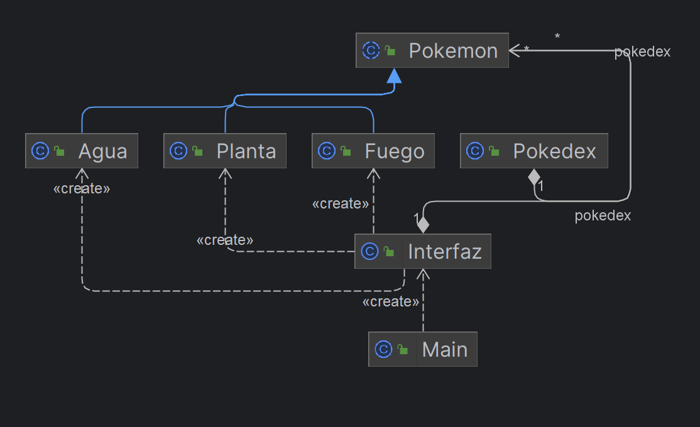

# Pokedex Manager

## Descripción

Pokedex Manager es una aplicación de consola simple que permite a los usuarios gestionar una Pokedex de Pokémon de
diferentes tipos (Planta, Fuego, Agua). Los usuarios pueden crear, modificar, eliminar y mostrar información detallada
de Pokémon en la Pokedex.

## Instrucciones de Uso (Usuarios)

1. **Iniciar el Programa:** Ejecute la aplicación y siga las instrucciones en el menú para realizar diversas operaciones
   en la Pokedex.
2. **Crear Pokémon:** Agregue nuevos Pokémon a la Pokedex especificando el tipo (Planta, Fuego, Agua) y proporcionando
   detalles como nombre, número de Pokedex, descripción, etc.
3. **Modificar Pokémon:** Actualice la información de un Pokémon existente, como su nombre, descripción, altura, peso,
   etc.
4. **Eliminar Pokémon:** Elimine un Pokémon de la Pokedex según su índice.
5. **Mostrar Pokedex:** Visualice la lista completa de Pokémon en la Pokedex.
6. **Guardar Datos:** Guarde los datos de la Pokedex en un archivo CSV para conservar los cambios realizados.
7. **Salir del Programa:** Finalice la aplicación cuando haya completado las operaciones deseadas.

## Instrucciones de Desarrollo (Desarrolladores)

### Requisitos Previos

- Java JDK instalado en el entorno de desarrollo.

### Estructura del Proyecto

- `src`: Contiene los archivos fuente del programa, divididos en paquetes (`presentacion` y `dominio`).
- `pokedex.csv`: Archivo de datos CSV utilizado para almacenar la información de la Pokedex.

### Compilación y Ejecución

1. Compile los archivos fuente utilizando el comando `javac` en la terminal.
   ```bash
   javac src/presentacion/*.java src/dominio/*.java


